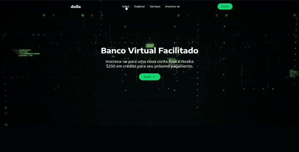

# :money_with_wings: WebSite-Dolla :money_with_wings:	

Website de banco virtual totalmente responsivo.

  <a href="##Projeto">Projeto</a> &nbsp;&nbsp;&nbsp;|&nbsp;&nbsp;&nbsp;
  <a href="##Layout">Layout</a> &nbsp;&nbsp;&nbsp;|&nbsp;&nbsp;&nbsp;
  <a href="##Tecnologias">Tecnologias</a> &nbsp;&nbsp;&nbsp;|&nbsp;&nbsp;&nbsp;
  <a href="##Como-executar">Como executar</a>

## :page_facing_up: Projeto
Website de banco virtual totalmente responsivo, com sistema de cadastro, login e banco de dados. Em que utilizei React.js, React-Scroll, React-Router, Redux e Styled-components como front-end, Node.js e Express como back-end, Axios para fazer requisições e MongoDB como banco de dados.

## :art: Layout

  

## :hammer_and_wrench: Tecnologias
Este projeto foi desenvolvido com as seguintes tecnologias

- [React.js](https://reactjs.org)
- [React-Scroll](https://www.npmjs.com/package/react-scroll)
- [React-Router](https://reactrouter.com)
- [Redux](https://redux.js.org)
- [Styled-components](https://styled-components.com)
- [Node.js](https://nodejs.org/en/)
- [Express](https://expressjs.com)
- [Axios](https://axios-http.com)
- [MongoDB](https://www.mongodb.com)

## :computer: Como executar
